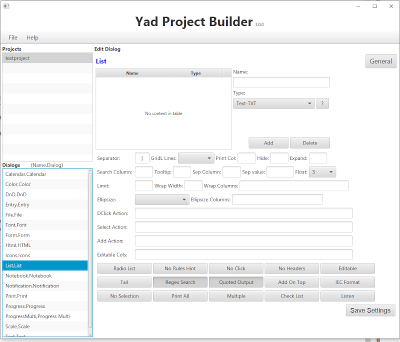
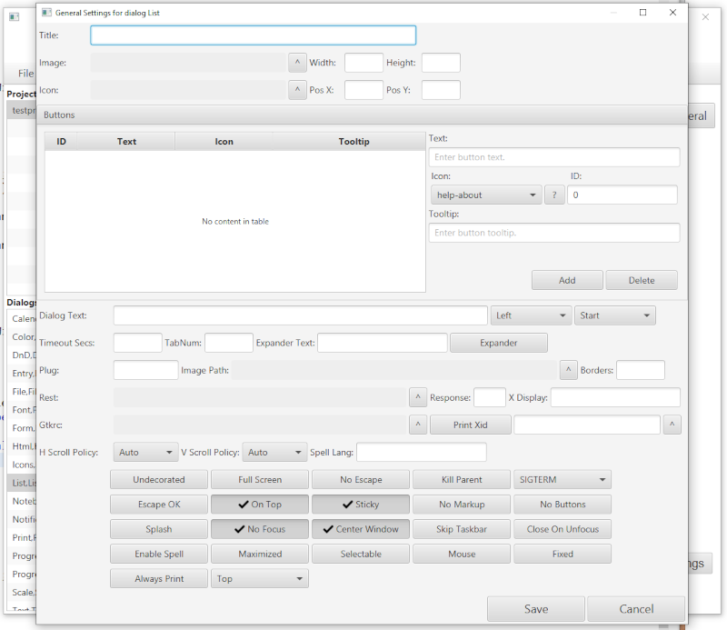
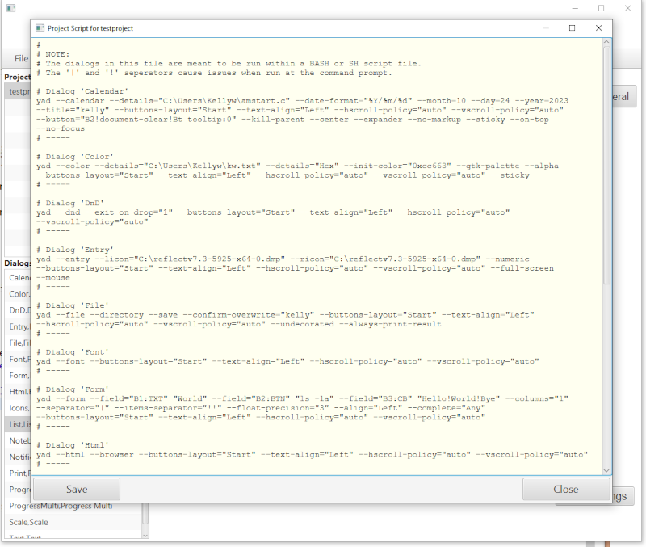

# YadPb
  *(YAD Project Builder)*  

This is a GUI frontend for the YAD program.  Allow you to create a project(s) to keep your YAD dailogs.

*Features:*

- A GUI to build YAD dialogs with.
- Each field has a tooltip to help you understand what each option is for.
- Unlimited number of projects.
- Unlimited number of dialogs per project.
- Keep all dialogs in a single place for a project.
- Generate Bash arrays for a dialog, this allows easier Bash script creation and better read ability.
- Backups are kept for each saved project.  So that you can go back to a previous change in the project.
- Create new projects from backed up projects.
- Give each dialog a unique name.

I used the version of YAD that comes with Ubuntu

Once a project has been created the use can start be adding different dialogs to the project.

Each dialog has its own set of command line options, plus the general options that go with each dialog.

The program can create the command line for of each of the dialogs created.  The command can be added to a Bash script
to create a user friendly GUI interface to a set of tasks.

Please refer to the manual pages of the YAD program.

This is a Java-FX desktop program.  You will need to install Java and the Java-FX jar files.  Thier are many
tutorials online to help with this.

Linux tiger 5.15.0-56-generic #62-Ubuntu SMP Tue Nov 22 19:54:14 UTC 2022 x86\_64 x86\_64 x86\_64 GNU/Linux
Ubuntu 22.04.1 LTS

I used the version of YAD that came with this version of OS. YAD 0.40.0

I created this with Java 18 and JavaFX 19 on a Ubuntu system.

```
openjdk version "18.0.2-ea" 2022-07-19
OpenJDK Runtime Environment (build 18.0.2-ea+9-Ubuntu-222.04)
OpenJDK 64-Bit Server VM (build 18.0.2-ea+9-Ubuntu-222.04, mixed mode, sharing)
```

I used apt install to get Java 18 and downloaded openfx 19 from the web. I installed javafx into my local
directory but you can install it whereever.

The environment varaible **PATH\_TO\_FX** needs to point to the lib directory of the javafx install.





